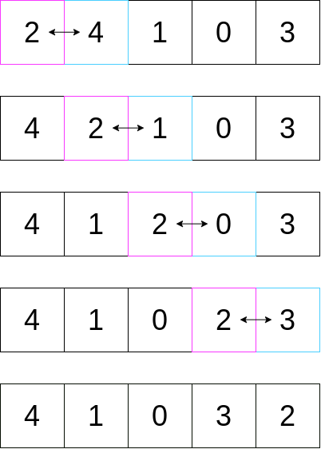
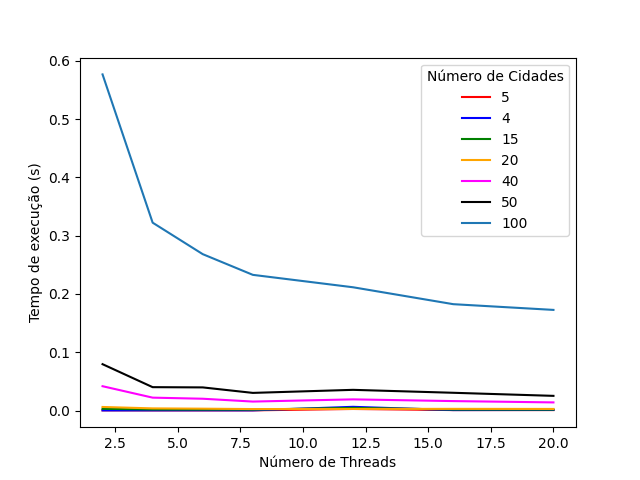
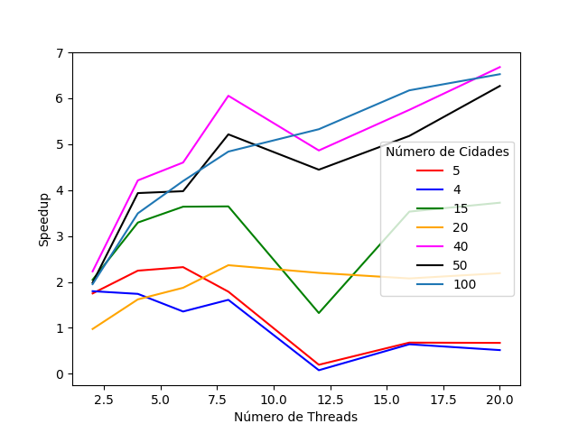

# Traveling Salesperson Problem (TSP)

## Introdução
O problema do caixeiro viajante é baseado na seguinte pergunta: dada uma lista de cidades e a distância entre cada uma delas, qual a menor distância de modo que o caixeiro viajante visite todas as cidades e volte à cidade de origem?

É um problema classificado como NP-hard de otimização.

## Utilização

### Compilação

- Script: Makefile

Para compilar o script, rode o comando `make` dentro do diretório raiz `./TSP-algo`

### Testes

___

## Heurística da cidade mais próxima
A heurística da cidade mais próxima é o modo mais simples de resolver o TSP. Consiste em procurar, a cada iteração, a cidade mais próxima da atual iteração. COm esta implementação, não se sabe se o caminho final é o cominho realmente mais curto. Pode-se verificar esta afirmação a a partir dos outros algoritmos implementados [Busca Local](##Busca-local) e [Busca Exaustiva](##Busca-exaustiva).
[An Internal Link to a Section Heading](/guides/content/editing-an-existing-page#modifying-front-matter)


```c++

void find_nearest(vector<city> cities) {
    vector<int> path;
    double tour = 0.0;
    double dist;
    double dist_to_nearest;
    city current_city = cities[0];
    city first_city = cities[0];
    city nearest_city;
    path.push_back(current_city.id);
    cities.erase(cities.begin());

    while (!cities.empty()) {
        nearest_city = cities[0];
        for (int next = 0; next < (int) cities.size(); next++) {            
            dist = euclidean(current_city, cities[next]);
            dist_to_nearest = euclidean(current_city, nearest_city);
            if (dist <= dist_to_nearest) {
                nearest_city = cities[next];
            } 
        }
        tour += euclidean(current_city, nearest_city);
        current_city = nearest_city;
        path.push_back(current_city.id);
        remove_city(cities, current_city.id);
    }
    tour += euclidean(first_city, nearest_city);
    print_output(path, tour);
}
```
Para mais detalhes e comentários observe o arquivo em C++ da [heurística da cidade mais próxima](heuristico/main.cpp).
___

## Busca local
Para mais detalhes observe o arquivo em C++ da [busca local](heuristico/main.cpp).

O algoritmo de busca local, um algoritmo de otimização faz pequenas alterações até achar uma solução ótima. Neste projeto, a abordagem consiste em trocar a ordem das cidades visitadas sucessivamente, até que a rota com menor distância seja encontrada.

Para a busca local, foi feito o seguinte algoritmo:
```c++
void sequential_random_search(vector<city> cities, int n_cities) {
    std::default_random_engine rng(10);
    vector<city> best_tour = cities;
    int last_index = (int) cities.size() - 1;
    for (int i = 0; i < 10*n_cities; i++) {
        vector<city> best_tour_inner = cities;
        std::shuffle(std::begin(best_tour_inner), std::end(best_tour_inner), rng);
        vector<city> swapped = best_tour_inner;
        for (int i = 0; i < last_index; i++) {     
            swap(swapped[i], swapped[i+1]);
            if (isPathShorter(best_tour_inner, swapped)) best_tour_inner = swapped;
        }
        if (isPathShorter(best_tour, best_tour_inner)) best_tour = best_tour_inner;
        }
    }
```

No qual, em $100 \cdot n_{cidades}$ iterações, a ordem das cidades é randomizada, e, em seguida a ordem é trocada, de acordo com o seguinte exemplo:



Em cada etapa, temos o cálculo do *tour*, ou seja, da distância total percorrida. Essas distâncias são comparadas, e o mínimo local é selecionado como a melhor solução. Fazendo esse processo, $100 \cdot n_{cidades}$ vezes, temos um resultado teoricamente melhor do que a heurítica.

### Paralelismo multi-core

O algoritmo mostrado em [1] é sequencial, de modo que é realizado em um thread da máquina apenas. Pode-se, porém, otimizar esse algoritmo, paralelizando-o.

Note que existem 2 loops *for* no códgo [1]. Podemos paralelizar o primeiro loop, definindo o número de threads que se quer utilizar. Assim, o código modificado fica da seguinte forma:

```c++
void parallel_random_search(vector<city> cities, int n_cities) {
    std::default_random_engine rng(123);
    vector<city> best_tour = cities;
    int last_index = (int) cities.size() - 1;

    #pragma omp parallel num_threads(20)
    {   
        cout << "We are " << omp_get_num_threads();
        #pragma omp for
        for (int i = 0; i < 10*n_cities; i++) {
        vector<city> best_tour_inner = cities;
        std::shuffle(std::begin(best_tour_inner), std::end(best_tour_inner), rng);
        vector<city> swapped = best_tour_inner;
        for (int i = 0; i < last_index; i++) {     
            swap(swapped[i], swapped[i+1]);
            if (isPathShorter(best_tour_inner, swapped)) best_tour_inner = swapped;
        }
        if (isPathShorter(best_tour, best_tour_inner)) best_tour = best_tour_inner;
        }
    }
}
```

Para paralelizar o código, utilizou-se o OpenMP, um conjunto de extensões para C/C++ e Fortran. O OpenMP permite a paralelização de algoritmos sequenciais em ambientes multi-core, e não requere, em geral, extensivas mudanças no código original. No caso do código [2], foi apenas necessário adicionar a linha `#pragma omp parallel num_threads(20)`, que cria uma heap de threads, e a linha `#pragma omp for` para indicar que se deseja paralelizar o loop *for*.

### Resultados - paralelismo
Na imagem 1, temos a comparação de desempenho do código paralelizado com OpenMP do **Número de Threads** por **Tempo em Segundos**. Pode-se perceber, pelo gráfico, que o tempo de execução diminui ligeiramente conforme o número de threads aumenta. Percebe-se, ademais, que conforme o N aumenta - N sendo o número de cidades que devem ser visitadas - a diminuição do tempo de execução é mais drástica. 


A imagem 2 mostra com mais clareza esta diminuição. Neste caso, mostra-se o Speedup, ou seja, quantas vezes mais rápida é a execução em comparação ao algoritmo sequencial. Nota-se que, até 20 cidades, o Speedup não é condizente com a lógica de multi-core, de modo que a impressão passada é que o algoritmo não é eficiente para um N pequeno. A partier de 20 cidades, porém, percebe-se um Speedup muito mais significante - chegando a 7.



___

## Busca exaustiva
Para mais detalhes observe o arquivo em C++ da [busca exaustiva](heuristico/main.cpp).

```c++

```
___

## O método ideal
O problema do caixeiro viajante é infame, e vem sendo estudado há tempos, juntamente com outros problemas NP-completos, NP-difíceis e outros algoritmos de alta complexidade computacional. O método ideal na resolução do caixeiro viajante, em última análise, depende da entrada. Podemos inicialmente  

## Paralelismo em GPU
Para mais detalhes observe o arquivo em C++ do [paralelismo em GPU](heuristico/main.cpp).

```c++

```
___

## Comparações de desempenho
Muitos gráficos bem descritos :)
```c++

```


___

## Conclusão

<!-- 
$w(n) = \alpha - \beta\cos\frac{2\pi n}{N-1}$, where $\alpha=0.54$ and $\beta=0.46$ -->
