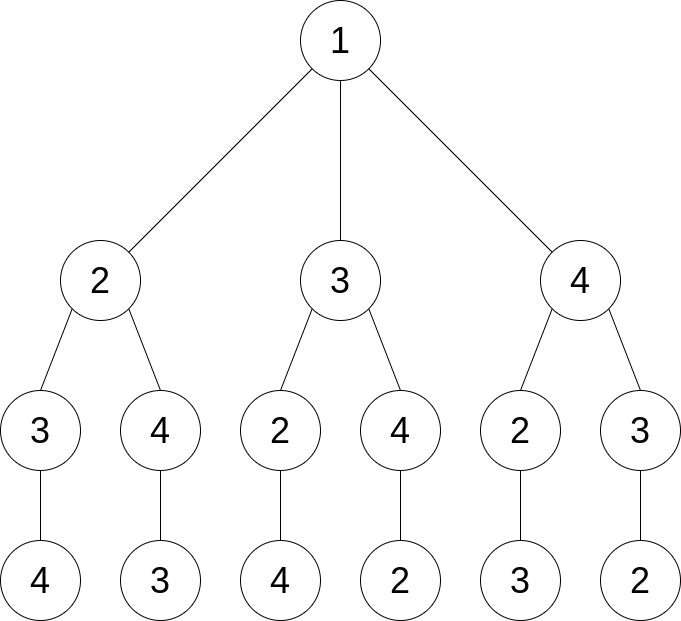

# Traveling Salesperson Problem (TSP)

## Introdução
O problema do caixeiro viajante é baseado na seguinte pergunta: dada uma lista de cidades e a distância entre cada uma delas, qual a menor distância de modo que o caixeiro viajante visite todas as cidades e volte à cidade de origem?

É um problema classificado como NP-hard de otimização.

## Utilização

### Compilação

- Script: Makefile

Para compilar o script, rode o comando `make` dentro do diretório (`/heuristico`, `/busca-local` ou `/busca-exaustiva`). No caso da busca local, o script compila todas as versões da busca local.

### Especificações de Hardware
Todos os algoritmos criados foram rodados localmente em uma máquina com as seguintes especificações de hardware:

|   |  | 
|----|---------------|
| Arquitetura | x86_64  |
| CPU MHz | 900.026  |
| Modelo CPU| Intel(R) Core(TM) i7-9750H CPU @ 2.60GHz  |
| CPUs | 12  |
| Modelo GPU | TU116M [GeForce GTX 1660 Ti Mobile]|
___

E as seguintes especificações de software:
|   |  | 
|----|---------------|
| OS | Pop!_OS 22.04 LTS  |
| Versão do g++ | 11.3.0  |
| Versão do OpenMP | 4.5  |
| Versão do CUDA | 11.5  |

## Heurística da cidade mais próxima
A heurística da cidade mais próxima é o modo mais simples de resolver o TSP. Consiste em procurar, a cada iteração, a cidade mais próxima da atual iteração. COm esta implementação, não se sabe se o caminho final é o cominho realmente mais curto. Pode-se verificar esta afirmação a a partir dos outros algoritmos implementados [Busca Local](##Busca-local) e [Busca Exaustiva](##Busca-exaustiva).

```{c++ heuristic}

void find_nearest(vector<city> cities) {
    vector<int> path;
    double tour = 0.0;
    double dist;
    double dist_to_nearest;
    city current_city = cities[0];
    city first_city = cities[0];
    city nearest_city;
    path.push_back(current_city.id);
    cities.erase(cities.begin());

    while (!cities.empty()) {
        nearest_city = cities[0];
        for (int next = 0; next < (int) cities.size(); next++) {            
            dist = euclidean(current_city, cities[next]);
            dist_to_nearest = euclidean(current_city, nearest_city);
            if (dist <= dist_to_nearest) {
                nearest_city = cities[next];
            } 
        }
        tour += euclidean(current_city, nearest_city);
        current_city = nearest_city;
        path.push_back(current_city.id);
        remove_city(cities, current_city.id);
    }
    tour += euclidean(first_city, nearest_city);
    print_output(path, tour);
}
```
Para mais detalhes e comentários observe o arquivo em C++ da [heurística da cidade mais próxima](heuristico/main.cpp).
___

## Busca local

O algoritmo de busca local, um algoritmo de otimização faz pequenas alterações até achar uma solução ótima. Neste projeto, a abordagem consiste em trocar a ordem das cidades visitadas sucessivamente, até que a rota com menor distância seja encontrada.

Para a busca local, foi feito o seguinte algoritmo:
```{c++ sequential_random}
void sequential_random_search(vector<city> cities, int n_cities) {
    std::default_random_engine rng(10);
    vector<city> best_tour = cities;
    int last_index = (int) cities.size() - 1;
    for (int i = 0; i < 10*n_cities; i++) {
        vector<city> best_tour_inner = cities;
        std::shuffle(std::begin(best_tour_inner), std::end(best_tour_inner), rng);
        vector<city> swapped = best_tour_inner;
        for (int i = 0; i < last_index; i++) {     
            swap(swapped[i], swapped[i+1]);
            if (isPathShorter(best_tour_inner, swapped)) best_tour_inner = swapped;
        }
        if (isPathShorter(best_tour, best_tour_inner)) best_tour = best_tour_inner;
        }
    }
```
Para mais detalhes observe o arquivo em C++ da [busca local](busca-local/main.cpp).


No qual, em $100 \cdot n_{cidades}$ iterações, a ordem das cidades é randomizada, e, em seguida a ordem é trocada, de acordo com o seguinte exemplo:


Em cada etapa, temos o cálculo do *tour*, ou seja, da distância total percorrida. Essas distâncias são comparadas, e o mínimo local é selecionado como a melhor solução. Fazendo esse processo, $100 \cdot n_{cidades}$ vezes, temos um resultado teoricamente melhor do que a heurítica.

### Paralelismo multi-core

O algoritmo mostrado em [1] é sequencial, de modo que é realizado em um thread apenas. Pode-se, porém, otimizar esse algoritmo, paralelizando-o.

Em alguns casos, algoritmos sequenciais são mais eficientes do que algoritmos paralelizados. Em geral, algoritmos com poucas iterações não têm grande probabilidade de melhora de desempenho com paralelização.

Alguns fatores que impedem ou não fazem a otimizam o algoritmo sequencial são:
- Métodos não thread-safe
- Acesso à memória compartilhada (race conditions)
- Limitações de hardware (processadores)

Neste caso, os resultados foram otimizados com paralelização, como demonstrado pelos resultados do relatório.

Note que existem 2 loops *for* no código [1]. Podemos paralelizar o primeiro loop, definindo o número de threads que se quer utilizar. Assim, o código modificado fica da seguinte forma:

```{c++ parallel_random, echo=FALSE}
void parallel_random_search(vector<city> cities, int n_cities) {
    std::default_random_engine rng(123);
    vector<city> best_tour = cities;
    int last_index = (int) cities.size() - 1;

    #pragma omp parallel num_threads(20)
    {   
        cout << "We are " << omp_get_num_threads();
        #pragma omp for
        for (int i = 0; i < 10*n_cities; i++) {
        vector<city> best_tour_inner = cities;
        std::shuffle(std::begin(best_tour_inner), std::end(best_tour_inner), rng);
        vector<city> swapped = best_tour_inner;
        for (int i = 0; i < last_index; i++) {     
            swap(swapped[i], swapped[i+1]);
            if (isPathShorter(best_tour_inner, swapped)) best_tour_inner = swapped;
        }
        if (isPathShorter(best_tour, best_tour_inner)) best_tour = best_tour_inner;
        }
    }
}
```
Para paralelizar o código, utilizou-se o OpenMP, um conjunto de extensões para C/C++ e Fortran. O OpenMP permite a paralelização de algoritmos sequenciais em ambientes multi-core, e não requere, em geral, extensivas mudanças no código original. No caso do código [2], foi apenas necessário adicionar a linha `#pragma omp parallel num_threads(20)`, que cria uma heap de threads, e a linha `#pragma omp for` para indicar que se deseja paralelizar o loop *for*.

### Resultados - paralelismo multi-core
<br> 


Na Figura 1, temos a comparação de desempenho do código paralelizado com OpenMP do **Número de Threads** por **Tempo em Segundos**. Pode-se perceber, pelo gráfico, que o tempo de execução diminui ligeiramente conforme o número de threads aumenta. Percebe-se, ademais, que conforme o N aumenta - N sendo o número de cidades que devem ser visitadas - a diminuição do tempo de execução é mais drástica. 

Abaixo, a tabela de resultados dos experimentos de threads e N que orginou a Figura 1.

| N/Threads  | Sequencial |     2     |    4      |   6  | 8 | 12 | 20|
|----|---------------|-----------|-----------|------|---|--|--|
|  5 |0.00052s    |0.00030s |0.00023s| 0.00022s  |  0.00029s |0.0026s|0.0007s|0.00078s
|  4 |   0.0005s      |0.00027s|0.00028s|  0.00036s | 0.00031s  |0.0063s|0.0007s|0.00096s
| 15 |0.00597s     | 0.00291s |0.0018s | 0.0016s  | 0.0016s  |0.0045s|0.0016s|0.00160s
| 20 | 0.0931s     |0.00610s |0.00368s |  0.00318s | 0.00252s |0.0027s|0.0028s|0.00272
| 40 | 0.1578s|0.04174s |0.02211s| 0.02024s | 0.01538s|0.01915s|0.0162s|0.01394s
| 50 |  1.1269s|0.07955s|0.04010s| 0.03969s|0.03027s|0.03550s|0.0304s|0.02518s
| 100 |  1.1269s    | 0.5768s  |0.3224s   |  0.2683s |  0.2328s |0.2115s|0.1825s|0.17270s

<br> 

A Figura 2 mostra com mais clareza esta diminuição. Neste caso, mostra-se o Speedup, ou seja, quantas vezes mais rápida é a execução em comparação ao algoritmo sequencial. Nota-se que, até 20 cidades, o Speedup não é condizente com a lógica de multi-core, de modo que a impressão passada é que o algoritmo não é eficiente para um N pequeno. A partir de 20 cidades, porém, percebe-se um Speedup muito mais significante - chegando a 7.


___

<br>

### Paralelismo em GPU
A GPU (Graphics Processing Unit) é, em geral, ideal para códigos paralelizáveis, porque maximiza o throughput, ou seja, tem uma alta taxa de transferência. É ideal para tratar de grandes volumes de dados.
A GPU pode ser até 10X mais rápida que a CPU para códigos paralelos.

Para mais detalhes observe o arquivo em C++ do [paralelismo em GPU](busca-local/main.cu).

___

## Busca exaustiva
A busca exaustiva, também chamada de abordagem brute-force, calcula **todas** os caminhos possíveis, compara, e escolhe o melhor resultado. 
Neste algoritmo, é utilizada uma abordagem recursiva, de acordo com o seguinte diagrama:




Para mais detalhes observe o arquivo em C++ da [busca exaustiva](busca-exaustiva/main.cpp).
___

<br> 

## O método ideal (Se você pudesse escolher um método para resolver este problema, qual seria?)
O problema do caixeiro viajante vem sendo estudado há tempos, juntamente com outros problemas NP-completos, NP-difíceis e outros algoritmos de alta complexidade computacional. O método ideal na resolução do caixeiro viajante, em última análise, depende da entrada. Considerando uma entrada pequena, não vale a pena, de acordo com o estudo feito, paralelizar o código. Deste modo, a busca local sequencial mostra bons resultados.

Considerando, por outro lado, uma entrada grande, com muitos dados, começa a ser viável e atrativo paralelizar o código. Assim, podemos considerar que a busca local em GPU e multi-core são boas opções.

### Busca Exaustiva (Vale a pena esperar pelo resultado da busca exaustiva?)

Quando se trata da busca exaustiva, há alguns problemas que devem ser tratados. Apesar de conseguir o ótimo global, com grandes quantidades de dados, nào costuma valer a pena esperar pelos resultados. Apesar disso, tem grande valor teórico. Em termos práticos, por outro lado, não é uma solução viável devido a complexidade de tempo *O(N!)* - a busca exaustiva não é escalável.

É importante ressaltar a importância de um código otimizado. Não é nada eficiente paralelizar um código no qual a versão sequencial não é eficiente.

<br>

## Restrições e Escalabilidade de Hardware com Paralelismo (Valeria a pena gastar dinheiro comprando uma CPU com mais cores ou uma GPU potente?)
A partir das discussões de algoritmo ideal, surge a pergunta de escalabilidade de hardware. Vale a pena investir em CPUs e GPUs, para cada abordagens paralelizadas?

No caso da paralelizaçào de dados da busca local, temos que a partir de um certo número de processadores, o desempenho não aumenta mais, de acordo com a lei de Amdahl, ilustrada na seguinte figura:


Ou seja, com um código embaraçosamente paralelo, o máximo de Speedup é atingido com 4096 processadores, de modo que a compra de mais processadores não aumentaria a eficiência do algoritmo e seria, portanto, infrutuoso.

Quando aumentamos o tamanho do problema, adicionando mais cidades, entramos na lei de Gustafson, que extende a lei de Amhdal.
Ele propõe que aumentando N para máquinas multi-core pode manter a escalabilidade quando se trata de número de processadores. Ele diz, portanto, que é eficiente paralelizar o código com uma máquina multi-core poderosa apenas quando o dataset é grande.

Assim, tratando-se da GPU, é eficiente investir nesse tipo de hardware para aplicações paralelizadas quando temos grandes volumes de dados.
___
